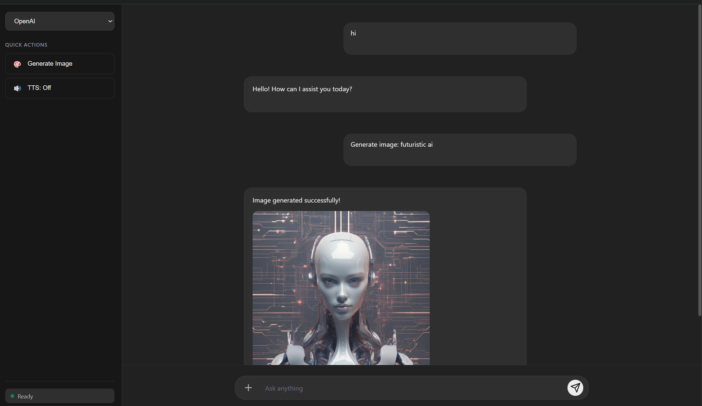

# OmniChat - Multi-Modal AI Assistant


A FastAPI-based multi-modal chatbot with vision, text-to-speech, and image generation capabilities.

## 🎯 Features

- **Text Chat**: Multiple LLM providers (OpenAI, Groq, Gemini, Qwen, Llama)
- **Vision**: Analyze images with Gemini vision model
- **Text-to-Speech**: Generate speech with gTTS
- **Image Generation**: Create images with Stable Diffusion
- **Web Search**: Tavily-powered web search tool calling (supported by Llama, Qwen, and Gemini models)

## 🛠️ Tech Stack

- **Backend**: FastAPI + Python 3.12
- **AI APIs**: Groq, Google Gemini, Fireworks AI, Tavily
- **Frontend**: Vanilla JavaScript, HTML, CSS
- **Cloud**: AWS ECR + App Runner + Secrets Manager
- **CI/CD**: GitHub Actions

## 🚀 Quick Start

### Prerequisites

- Python 3.12+
- API Keys:
  - Groq API key
  - Google Gemini API key
  - Fireworks AI API key
  - Tavily API key

### Installation

1. Clone the repository:

```bash
git clone <your-repo-url>
cd 1.Multi_Modal_chatbot
```

2. Install dependencies:

```bash
pip install -r requirements.txt
```

3. Create `.env` file:

```bash
cp .env.example .env
# Edit .env with your API keys
```

4. Run the application:

```bash
python app.py
```

5. Open browser:

```
http://localhost:8000
```

## 🐳 Docker Deployment

### Build and Run

```bash
docker build -t multimodal-chatbot .
docker run -p 8000:8000 --env-file .env multimodal-chatbot
```

## ☁️ AWS Deployment

### Services Used

| Service | Purpose |
|---|---|
| ECR | Docker image registry |
| App Runner | Managed container hosting |
| Secrets Manager | API key storage |

### Setup

1. Store API keys in **AWS Secrets Manager** under secret name `multimodal-chatbot`
2. Push Docker image to **ECR**
3. Deploy via **App Runner** pointing to the ECR image

### GitHub Actions CI/CD

Add the following secrets to your GitHub repository:

| Secret | Description |
|---|---|
| `AWS_ACCESS_KEY_ID` | IAM user access key |
| `AWS_SECRET_ACCESS_KEY` | IAM user secret key |

On every push to `main`, the workflow will:
1. Build the Docker image
2. Push to ECR
3. Trigger a new deployment on App Runner

## 📁 Project Structure

```
1.Multi_Modal_chatbot/
├── app.py                 # FastAPI application
├── models/                # AI model wrappers
│   ├── chat_models.py    # Chat models
│   └── tools.py          # Tool calling (Tavily)
├── services/              # Service layer
│   ├── image_service.py  # Vision & image generation
│   └── speech_service.py # TTS
├── utils/                 # Utilities
│   ├── config.py         # Configuration (Secrets Manager + .env)
│   └── logger.py         # Logging
├── static/                # Frontend
│   ├── index.html
│   ├── script.js
│   └── style.css
├── .github/workflows/     # CI/CD
│   └── deploy.yml
├── Dockerfile
├── .dockerignore
├── logs/                  # Application logs
├── uploads/               # Uploaded files
└── requirements.txt
```

## 📡 API Endpoints

- `POST /api/chat` - Text chat with streaming
  - Parameters: `message`, `model` (openai/groq/qwen/llama/gemini), `use_tools` (default: true)
- `POST /api/vision/analyze` - Analyze images
- `POST /api/speech/synthesize` - Generate speech (TTS)
- `POST /api/image/generate` - Generate images
- `POST /api/chat/clear` - Clear conversation history

## 📸 Screenshots


_Multi Modal Chatbot Interface with image generation_

## 📄 License

MIT License
